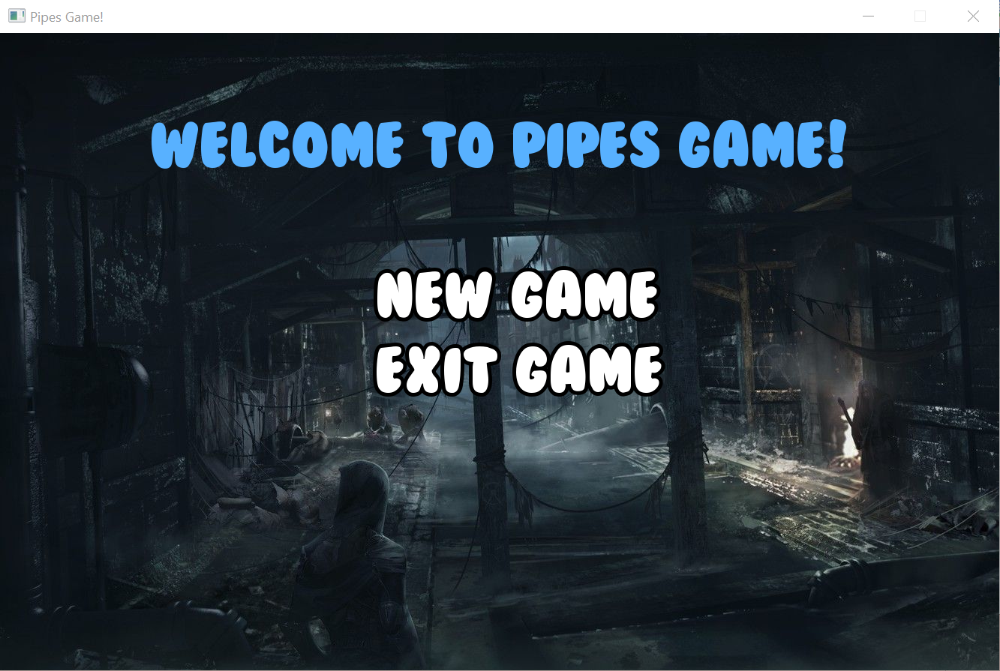
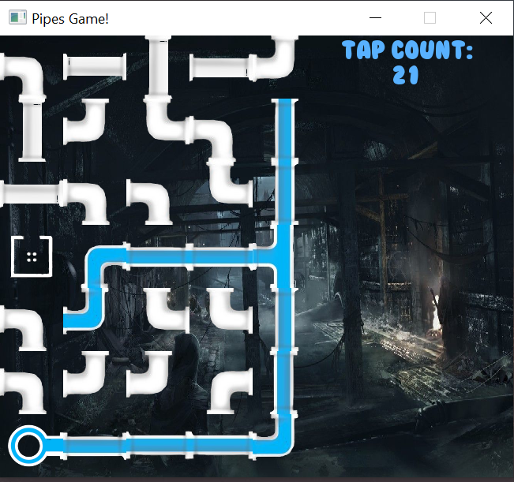
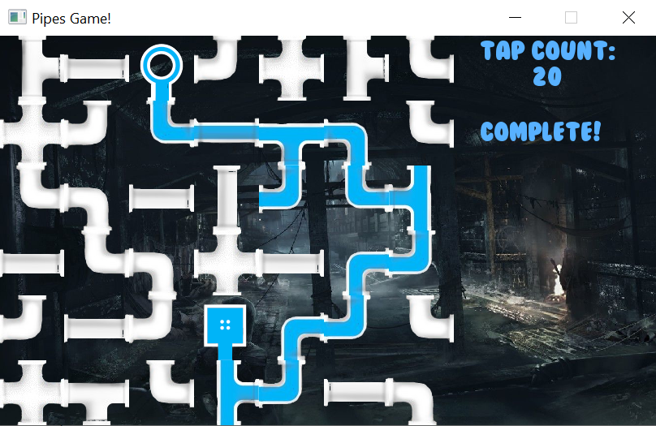

# Pipes Game
## Description
Implemention of the puzzle game Pipes written in C++.

## Key concepts
* Class inheritance
* Polymorphism
* SFML
* Singleton design pattern
* Templates
* C++ Standard library: set, map, vector, list
* Custom exceptions
* A generic graph implementation
* Implementation of the Breadth-First Search (BFS) algorithm

## Screenshots

